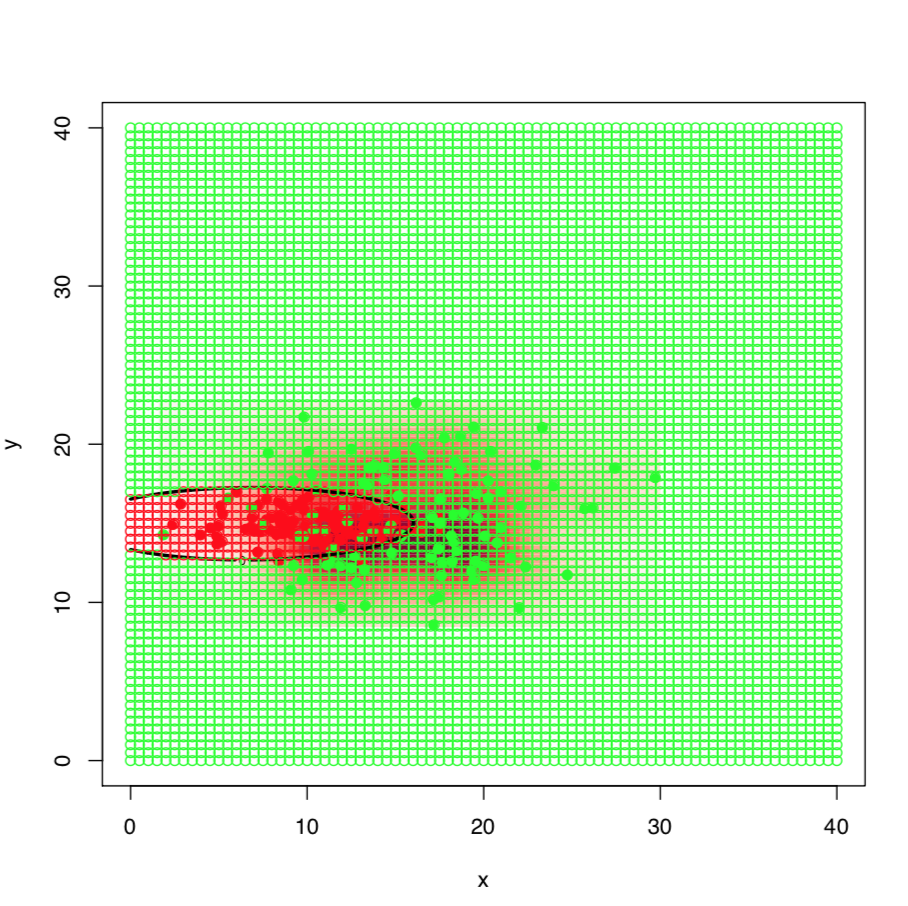
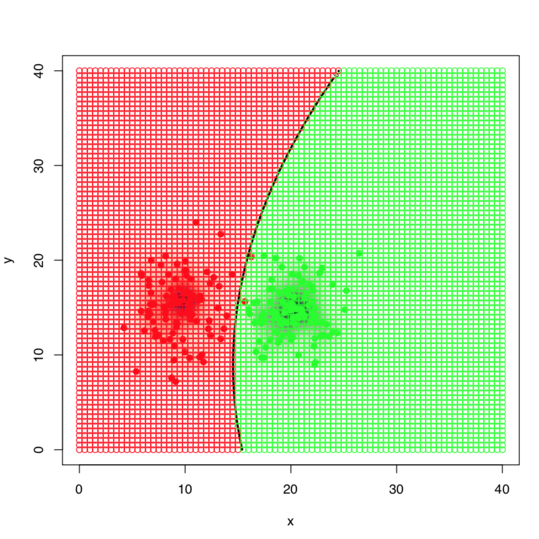

Лабораторные работы по СМПР

<b>Метрические алгоритмы</b>

# **1. Алгоритм классификации "1NN":**
   
Классифицируемый объект относим к тому классу, к которому принадлежит ближайший по заданной метрике "сосед" из выборки:

%20=%20%5Bi=1%5D)

В реализованном методе выбрана евклидова метрика.  
В качестве выборки был взят набор "Ирисы Фишера"  
Карта классификации выглядит следующим образом: 

# **2. Алгоритм классификации "kNN" k-ближайших соседей:**

Все объекты выборки сортируются по удаленности от классифицируемого объекта. Выбираются k ближайших соседей.
Классифицируемый объект относим к тому классу, который количественно преобладает среди выбраных k соседей:
%20=%20%5Bi%5Cleq%20k%5D)

Оптимальное количество соседей было выбрано по критерию скользящего контроля с исключением объектов по одному (leave-one-out) LOO. Дла каждого объекта обучающей выборки проводится классификация по k ближайшим соседям. Для данной реализации алгоритма график LOO выглядит следующим образом:

На графике видно, что LOO минимально при значении k=6. Карта классификации для алгоритма 6NN выглядит следующим образом:

# **3. Алгоритм классификации "kwNN" k-ближайших взвешенных соседей:**

Недостатоком алгоритма kNN является то, что он относит классифицируемый объект к классу, количество представителей которого преобладает среди k соседей.
Алгоритм kwNN подразумевает то, что каждый i-й сосед имеет определенную ценность и вносит свой вклад в классификацию объекта. Для определения веса подойдет какая-нибудь строго-убывающая последовательность, например )
Сам алгоритм выглядит так:
- отсортировать объекты выборки по удаленности от классифицируемого объекта
- выбрать k ближайших соседей
- каждому классу прибавить вес i-го соседа

Параметр q можно выбрать по критерию LOO.

Для алгоритма 6wNN график LOO выглядит так:

Хорошо видно, что LOO для алгоритма kwNN, где k = 6 и q = 0.05 значительно меньше чем для алгоритма kNN.

Карта классификации выглядит следующим образом: 

Преимущетсво алгоритма kwnn над knn демонстрируется на следующих изображениях:

слева алгоритм kwnn, справа - knn

# **4. Алгоритм классификации "метод парзеновского окна":**

Данный метод отличается от kwNN тем, что весовая функция зависит не от ранга соседа, а от расстояния от классифицируемого объекта до объекта выборки и параметра h(ширины окна) и функции ядра. Вокруг точки строится окрестность радиуса h и после выбирается тот класс, суммарный вес которого больше в этой окрестности.

) - произвольная четная функция, называемая функцией ядра или окна. Термин окно происходит из классического вида функции:

%20=%20%5Cfrac12%20%5B%7Cz%7C%20%3C%201%5D)

Карта классификации выглядит следующим образом: 

***Карта для прямоугольного ядра:***
=%5CPi(r)=%5Cfrac%7B1%7D%7B2%7D%7B%5B%7D%7B%7C%7Dr%7B%7C%7D%3C=1%7B%5D%7D)

***Карта для треугольного ядра:***
=T(r)=(1-%7B%7C%7Dr%7B%7C%7D)%7B%5B%7D%7B%7C%7Dr%7B%7C%7D%3C=1%7B%5D%7D)

***Карта для квартичного ядра:***
=Q(r)=%5Cfrac%7B15%7D%7B16%7D(1-r%5E2)%5E2%7B%5B%7D%7B%7C%7Dr%7B%7C%7D%3C=1%7B%5D%7D)

***Карта для ядра Епанечникова:***
=E(r)=%5Cfrac%7B3%7D%7B4%7D(1-r%5E2)%7B%5B%7D%7B%7C%7Dr%7B%7C%7D%3C=1%7B%5D%7D)

***Карта для Гауссовского ядра:***
=G(r)=(2%5Cpi)%5E%7B(-%5Cfrac%7B1%7D%7B2%7D)%7Dexp(-%5Cfrac%7B1%7D%7B2%7Dr%5E2))

# **6. Линии уровня нормального распределения":**

N-мерным нормальным распределением будет называться распределение с плотностью:

где μ - математическое ожидание, а Σ - матрица ковариации

Если признаки некоррелированны, то матрица ковариации имеет диагональный вид, а линия плотности имеет форму эллипсоида

Если признаки коррелированы, то матрица не диагональна, а линии уровня имеют форму эллипсоида, оси которого повернуты относительно системы координат

Если признаки имеют одинаковую дисперсию, то эллипсоиды являются сферами

# **7. Подстановочный алгоритм (plug-in):**

Суть алгоритма заключается в востановлении параметров нормального распределения μ и Σ по следующим формулам для каждого класса

Демонстрация будет проводиться на выборке из 100 элементов кадого класса.

В данном случае ковариационные матрицы не равны и разделяющая поверхность имеет форму элипсоида, тем самым менее плотный класс охватывает менее плотный.

В данном случае ковариационные матрицы не равны и разделяющая поверхность имеет форму элипсоида, тем самым менее плотный класс охватывает менее плотный.

В данном случае ковариационные матрицы равны и разделяющая поверхность больше походит на прямую

# **7. Наивный байесовский классификатор:**

Наивный байесовский классификатор основан на предположении, что объекты описываются независимыми признаками. Предположение о независимости существенно упрощает задачу, так как оценить n одномерных плотностей гораздо легче, чем одну n-мерную плотность. К сожалению, оно крайне редко выполняется на практике, поэтому данный классификатор и называется наивным.
Наивный байесовский классификатор имеет вид:

Карта классификации:

